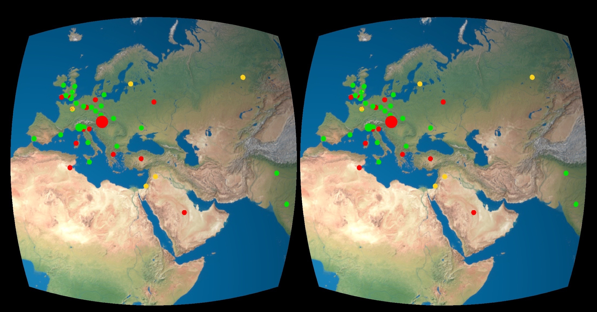

# Wikipedia Recent Changes WebVR Heatmap

This WebVR-Scene shows you the latest 150 anonymous Wikipedia edits mapped on a WebVR-Globe.
It uses the <a href="https://www.mediawiki.org/wiki/API:Recent_changes_stream" title="Visit API description" target="blank">__Wikipedia Stream API__</a>.

The size of the marker represents the number of lines changed, the colors show the different types of edits. The light in the scene is set to the position of the sun at the time you're loading the page.

|||
| --- | --- |

__Built with:__ <a href="https://aframe.io/" title="Visit page" target="_blank">A-Frame</a> & <a href="https://www.npmjs.com/package/aframe-react" title="Visit page" target="_blank">A-Frame React</a>

__IP lookup:__ <a href="https://freegeoip.net/" title="Visit page" target="_blank">freegeoip.net API</a>

__Inspired by:__ <a href="http://rcmap.hatnote.com/#en" target="_blank" title="Wikipedia Recent Changes Map">Wikipedia Recent Changes Map</a>

Just like Hatnote's <a href="http://rcmap.hatnote.com/#en" target="_blank" title="Wikipedia Recent Changes Map">__Wikipedia Recent Changes Map__</a>, this App shows only the edits made by unregistered users which account for only 15% of the actual edits of Wikipedia entries worldwide. This is because Wikipidia doesn't save the IP addresses of registered users.

### Image Credit:
__Equirectangular Earth Map:__ <a href="http://www.shadedrelief.com/natural3/pages/textures.html" title="Visit page" target="blank">Natural Earth III - Tom Patterson</a>
