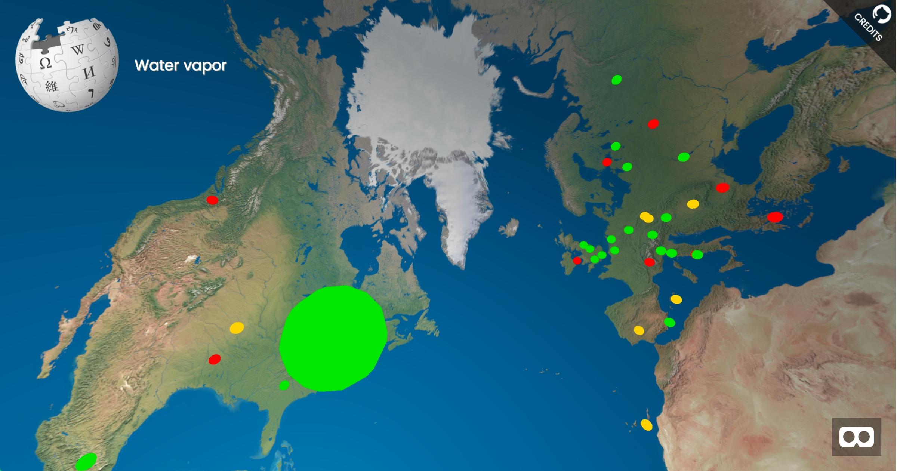
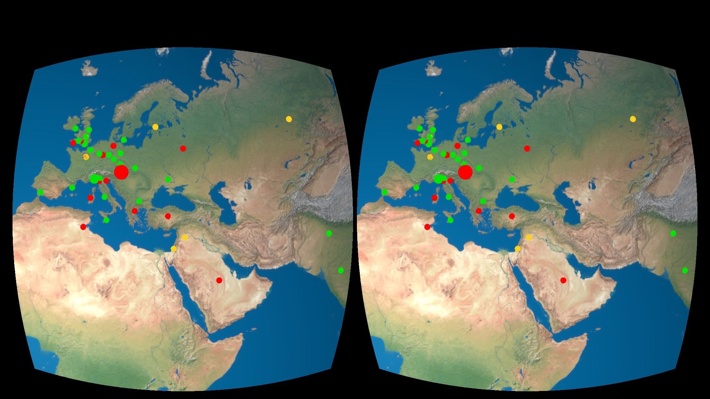

# Wikipedia recent changes VR-Livestream

This WebVR-Scene shows the latest 150 Wikipedia anonymous edits on a globe.
It uses the <a href="https://www.mediawiki.org/wiki/API:Recent_changes_stream" title="Visit API description" target="blank">Wikipeadia Stream API</a>.

The size of the marker represents the number of lines changed, the colors show the different types of edits.

IP lookup: <a href="https://freegeoip.net/" title="Visit page" target="blank">freegeoip.net API</a>

Inspired by: <a href="http://listen.hatnote.com/" target="blank" title="Listen to Wikipedia">Listen to Wikipedia</a>

## Image Credit:
Equirectangular Earth Map: <a href="http://www.shadedrelief.com/natural3/pages/textures.html" title="Visit page" target="blank">Natural Earth III - Tom Patterson</a>
